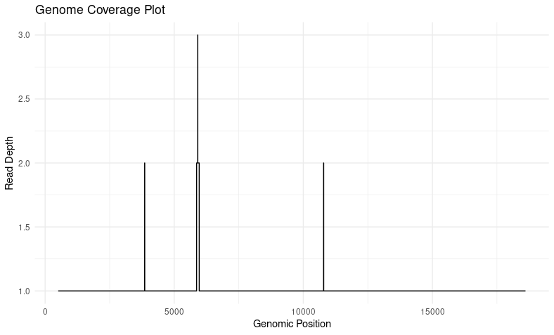
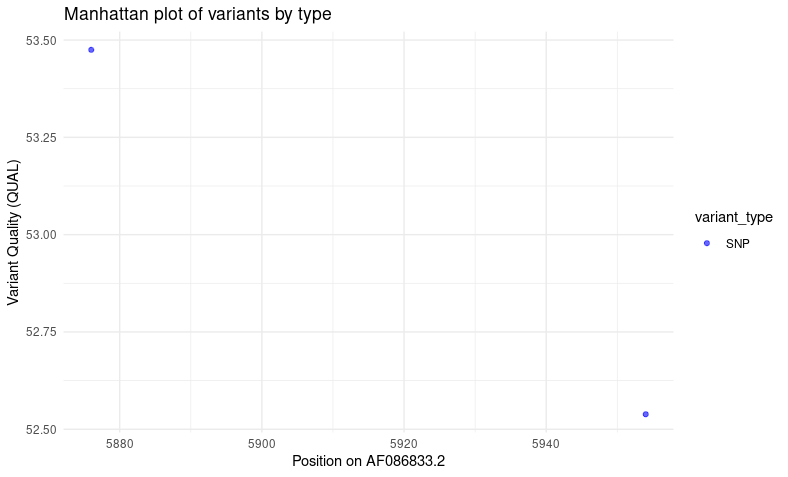
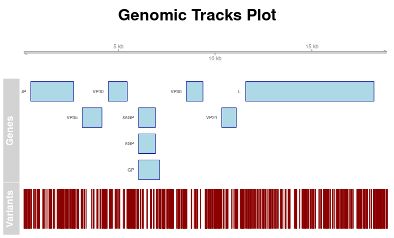
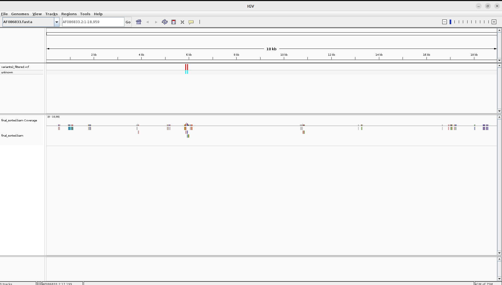

# NGS_variant_analysis
# NGS Variant Calling Pipeline

## Overview

This project demonstrates a complete **Next Generation Sequencing (NGS) analysis pipeline** for detecting genomic variants.

The workflow includes:

* Quality control of sequencing reads
* Read trimming
* Alignment to a reference genome
* Variant calling using two independent tools
* Variant comparison
* Visualization and statistical analysis in R

This repository was created as part of my training in **bioinformatics and genomic data analysis**.

---

# Dataset

Sequencing reads were obtained from the **Sequence Read Archive (SRA)**.

Reference genome:

AF086833.fasta

---

# Pipeline Workflow

## 1. Quality Control

Quality of raw sequencing reads was evaluated using:

* FastQC

This step identifies issues such as:

* low quality bases
* adapter contamination
* GC bias

---

## 2. Read Trimming

Adapters and low-quality bases were removed using:

* fastp

Output:

trimmed FASTQ files used for alignment.

---

## 3. Read Alignment

Trimmed reads were aligned to the reference genome using:

* BWA

Output:

SAM/BAM alignment files.

---

## 4. BAM Processing

Alignment files were sorted and indexed with:

* SAMtools

This allows efficient downstream analysis.

---

## 5. Variant Calling

Variants were detected using two independent callers.

### Method 1

* BCFtools

### Method 2

* FreeBayes

Comparing two callers increases reliability of detected variants.

---

## 6. Variant Visualization

Variants were inspected using:

* IGV

This allows manual inspection of read alignments.

---

# Data Visualization in R

Variant analysis and genomic visualization were performed in **R** using:

* Gviz
* VariantAnnotation
* ggplot2

---

# Results

## Coverage Plot

Genome coverage across the reference sequence.

---

## Variant Quality (Manhattan-style plot)

Quality scores for detected variants.

---

## Genome Track Visualization

Visualization of variants and coding regions along the genome.

---

## IGV Visualization

Manual inspection of variant positions.

---

# Skills Demonstrated

This project demonstrates practical skills in:

* NGS data processing
* command line bioinformatics
* variant detection
* genomic data visualization
* R programming for genomics

---

# Tools Used

* FastQC
* fastp
* BWA
* SAMtools
* BCFtools
* FreeBayes
* IGV
* Gviz
* ggplot2

---

# Author

Jânice Roberta de Paula

Bioinformatics student interested in:

* genomic data analysis
* computational biology
* precision medicine
* neurogenomics

---
